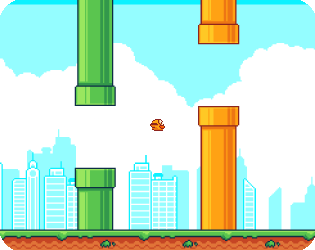
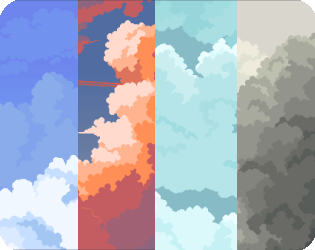
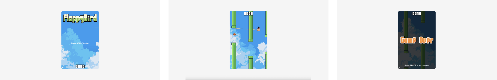

# Flappy Bird Clone

## 🔖 Table of contents

<details>
    <summary>
        CLICK TO ENLARGE 😇
    </summary>
    📄 <a href="#description">Description</a>
    <br>
    🎓 <a href="#objectives">Objectives</a>
    <br>
    🔨 <a href="#tech-stack">Tech stack</a>
    <br>
    📂 <a href="#files-description">Files description</a>
    <br>
    👾 <a href="#assets">Assets<a>
    <br>
    💻 <a href="#installation_and_how_to_use">Installation and how to use</a>
    <br>
    🔧 <a href="#whats-next">What's next?</a>
    <br>
    ♥️ <a href="#thanks">Thanks</a>
    <br>
    👷 <a href="#authors">Authors</a>
</details>

## 📄 <span id="description">Description</span>

This is a clone of the famous Flappy Bird, crafted from scratch in two days with vanilla HTML, CSS, and JavaScript.
<br>
This project offers both a fun challenge and a great opportunity to explore fundamental game development concepts: canvas layering, sprite animation, collision detection, parallax scrolling, audio control, and state persistence via `localStorage`.
<br>
It’s a compact and approachable example, ideal for understanding how a browser game is structured and functions.

## 🎓 <span id="objectives">Objectives</span>

- Rebuild a Flappy Bird experience using vanilla HTML/CSS/JS.
- Handle multiple canvas layers (UI / Game / Background).
- Implement game logic: gravity, jumps, obstacles, collisions.
- Add localStorage to save the best score.
- Use parallax scrolling for background immersion.
- Add sound management (toggleable) and keyboard controls.

## 🔨 <span id="tech-stack">Tech stack</span>

<p align="left">
    
    
    
    
    
    
    
</p>

## 📂 <span id="files-description">File description</span>

| **FILE**     | **DESCRIPTION**                                     |
| :----------: | --------------------------------------------------- |
| `assets`     | Contains the resources required for the repository. |
| `index.html` | Main HTML structure for the project.                |
| `style.css`  | Styles and animations for the project.              |
| `script.js`  | Behavior script for interactivity.                  |
| `README.md`  | The README file you are currently reading 😉.       |

## 👾 <span id="assets">Assets</span>

<table align="center">
  <tr>
    <td align="center">
      <a href="https://megacrash.itch.io/flappy-bird-assets" target="_blank">
        
      </a>
      <br>
      By <a href="https://megacrash.itch.io" target="_blank">Juan Camilo</a> from 
      <a href="https://itch.io/" target="_blank">itch.io</a>
    </td>
    <td align="center">
      <a href="https://free-game-assets.itch.io/free-sky-with-clouds-background-pixel-art-set" target="_blank">
        
      </a>
      <br>
      By <a href="https://free-game-assets.itch.io" target="_blank">CRAFTPIX</a> from 
      <a href="https://itch.io/" target="_blank">itch.io</a>
    </td>
  </tr>
</table>

## 💻 <span id="installation_and_how_to_use">Installation and how to use</span>

**Installation:**

1. Clone this repository:
    - Open your preferred Terminal.
    - Navigate to the directory where you want to clone the repository.
    - Run the following command:

```bash
git clone https://github.com/fchavonet/web-flappy_bird_clone.git
```

2. Open the repository you've just cloned.

**How to play:**

1. Open the `index.html` file in your web browser.

2. Press `SPACE` or `↑` arrow to start and to flap.

3. Avoid hitting pipes or the top/bottom edges.

4. Try to beat your best score!

> 📌 You can mute the sound by pressing the `s` key on your keyboard.

You can also test the game online by clicking [here](https://fchavonet.github.io/web-flappy_bird_clone/).

<p align="center">
    
</p>

## 🔧 <span id="whats-next">What's next?</span>

- Create a leaderboard system.
- Add mobile optimization with custom touch controls.
- Implement unlockable skins or themes.

## ♥️ <span id="thanks">Thanks</span>

- Thanks to the talented artists who provide free game assets for everyone to use and learn from.

## 👷 <span id="authors">Authors</span>

**Fabien CHAVONET**
- GitHub: [@fchavonet](https://github.com/fchavonet)
